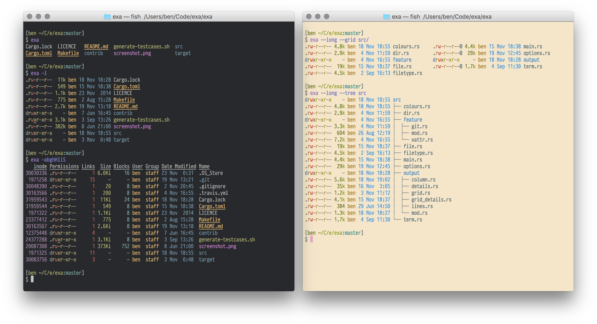

# exa

[exa](https://the.exa.website/) is a modern replacement for _ls_.

**README Sections:** [Options](#options) — [Installation](#installation) — [Development](#development)

---

**exa** is a modern replacement for the venerable file-listing command-line program `ls` that ships with Unix and Linux operating systems, giving it more features and better defaults.
It uses colours to distinguish file types and metadata.
It knows about symlinks, extended attributes, and Git.
And it’s **small**, **fast**, and just **one single binary**.

By deliberately making some decisions differently, exa attempts to be a more featureful, more user-friendly version of `ls`.
For more information, see [exa’s website](https://the.exa.website/).

---

<a id="options">
<h1>Command-line options</h1>
</a>

exa’s options are almost, but not quite, entirely unlike `ls`’s.

### Display options

- **-1**, **--oneline**: display one entry per line
- **-G**, **--grid**: display entries as a grid (default)
- **-l**, **--long**: display extended details and attributes
- **-R**, **--recurse**: recurse into directories
- **-T**, **--tree**: recurse into directories as a tree
- **-x**, **--across**: sort the grid across, rather than downwards
- **-F**, **--classify**: display type indicator by file names
- **--colo[u]r**: when to use terminal colours
- **--colo[u]r-scale**: highlight levels of file sizes distinctly
- **--icons**: display icons
- **--no-icons**: don't display icons (always overrides --icons)

### Filtering options

- **-a**, **--all**: show hidden and 'dot' files
- **-d**, **--list-dirs**: list directories like regular files
- **-L**, **--level=(depth)**: limit the depth of recursion
- **-r**, **--reverse**: reverse the sort order
- **-s**, **--sort=(field)**: which field to sort by
- **--group-directories-first**: list directories before other files
- **-D**, **--only-dirs**: list only directories
- **--git-ignore**: ignore files mentioned in `.gitignore`
- **-I**, **--ignore-glob=(globs)**: glob patterns (pipe-separated) of files to ignore

Pass the `--all` option twice to also show the `.` and `..` directories.

### Long view options

These options are available when running with `--long` (`-l`):

- **-b**, **--binary**: list file sizes with binary prefixes
- **-B**, **--bytes**: list file sizes in bytes, without any prefixes
- **-g**, **--group**: list each file’s group
- **-h**, **--header**: add a header row to each column
- **-H**, **--links**: list each file’s number of hard links
- **-i**, **--inode**: list each file’s inode number
- **-m**, **--modified**: use the modified timestamp field
- **-S**, **--blocks**: list each file’s number of file system blocks
- **-t**, **--time=(field)**: which timestamp field to use
- **-u**, **--accessed**: use the accessed timestamp field
- **-U**, **--created**: use the created timestamp field
- **-@**, **--extended**: list each file’s extended attributes and sizes
- **--changed**: use the changed timestamp field
- **--git**: list each file’s Git status, if tracked or ignored
- **--time-style**: how to format timestamps
- **--no-permissions**: suppress the permissions field
- **--octal-permissions**: list each file's permission in octal format
- **--no-filesize**: suppress the filesize field
- **--no-user**: suppress the user field
- **--no-time**: suppress the time field

Some of the options accept parameters:

- Valid **--color** options are **always**, **automatic**, and **never**.
- Valid sort fields are **accessed**, **changed**, **created**, **extension**, **Extension**, **inode**, **modified**, **name**, **Name**, **size**, **type**, and **none**. Fields starting with a capital letter sort uppercase before lowercase. The modified field has the aliases **date**, **time**, and **newest**, while its reverse has the aliases **age** and **oldest**.
- Valid time fields are **modified**, **changed**, **accessed**, and **created**.
- Valid time styles are **default**, **iso**, **long-iso**, and **full-iso**.

---

<a id="installation">
<h1>Installation</h1>
</a>

exa is available for macOS and Linux.
More information on how to install exa is available on [the Installation page](https://the.exa.website/install).

### Alpine Linux

On Alpine Linux, [enable community repository](https://wiki.alpinelinux.org/wiki/Enable_Community_Repository) and install the [`exa`](https://pkgs.alpinelinux.org/package/edge/community/x86_64/exa) package.

    apk add exa

### Arch Linux

On Arch, install the [`exa`](https://www.archlinux.org/packages/community/x86_64/exa/) package.

    pacman -S exa

### Android / Termux

On Android / Termux, install the [`exa`](https://github.com/termux/termux-packages/tree/master/packages/exa) package.

    pkg install exa

### Debian

On Debian, install the [`exa`](https://packages.debian.org/stable/exa) package.

    apt install exa

### Fedora

On Fedora, install the [`exa`](https://src.fedoraproject.org/modules/exa) package.

    dnf install exa

### Gentoo

On Gentoo, install the [`sys-apps/exa`](https://packages.gentoo.org/packages/sys-apps/exa) package.

    emerge sys-apps/exa

### Homebrew

If you’re using [Homebrew](https://brew.sh/) on macOS, install the [`exa`](http://formulae.brew.sh/formula/exa) formula.

    brew install exa

### MacPorts

If you're using [MacPorts](https://www.macports.org/) on macOS, install the [`exa`](https://ports.macports.org/port/exa/summary) port.

    port install exa

### Nix

On nixOS, install the [`exa`](https://github.com/NixOS/nixpkgs/blob/master/pkgs/tools/misc/exa/default.nix) package.

    nix-env -i exa

### openSUSE

On openSUSE, install the [`exa`](https://software.opensuse.org/package/exa) package.

    zypper install exa

### Ubuntu

On Ubuntu 20.10 (Groovy Gorilla) and later, install the [`exa`](https://packages.ubuntu.com/jammy/exa) package.

    sudo apt install exa

### Void Linux

On Void Linux, install the [`exa`](https://github.com/void-linux/void-packages/blob/master/srcpkgs/exa/template) package.

    xbps-install -S exa

### Manual installation from GitHub

Compiled binary versions of exa are uploaded to GitHub when a release is made.
You can install exa manually by [downloading a release](https://github.com/ogham/exa/releases), extracting it, and copying the binary to a directory in your `$PATH`, such as `/usr/local/bin`.

For more information, see the [Manual Installation page](https://the.exa.website/install/linux#manual).

### Cargo

If you already have a Rust environment set up, you can use the `cargo install` command:

    cargo install exa

Cargo will build the `exa` binary and place it in `$HOME/.cargo`.

To build without Git support, run `cargo install --no-default-features exa` is also available, if the requisite dependencies are not installed.

---

<a id="development">
<h1>Development

</h1></a>

exa is written in [Rust](https://www.rust-lang.org/).
You will need rustc version 1.56.1 or higher.
The recommended way to install Rust for development is from the [official download page](https://www.rust-lang.org/tools/install), using rustup.

Once Rust is installed, you can compile exa with Cargo:

    cargo build
    cargo test

- The [just](https://github.com/casey/just) command runner can be used to run some helpful development commands, in a manner similar to `make`.
Run `just --list` to get an overview of what’s available.

- If you are compiling a copy for yourself, be sure to run `cargo build --release` or `just build-release` to benefit from release-mode optimisations.
Copy the resulting binary, which will be in the `target/release` directory, into a folder in your `$PATH`.
`/usr/local/bin` is usually a good choice.

- To compile and install the manual pages, you will need [pandoc](https://pandoc.org/).
The `just man` command will compile the Markdown into manual pages, which it will place in the `target/man` directory.
To use them, copy them into a directory that `man` will read.
`/usr/local/share/man` is usually a good choice.

- exa depends on [libgit2](https://github.com/rust-lang/git2-rs) for certain features.
If you’re unable to compile libgit2, you can opt out of Git support by running `cargo build --no-default-features`.

- If you intend to compile for musl, you will need to use the flag `vendored-openssl` if you want to get the Git feature working.
The full command is `cargo build --release --target=x86_64-unknown-linux-musl --features vendored-openssl,git`.

For more information, see the [Building from Source page](https://the.exa.website/install/source).

### Testing with Vagrant

exa uses [Vagrant][] to configure virtual machines for testing.

Programs such as exa that are basically interfaces to the system are [notoriously difficult to test][testing].
Although the internal components have unit tests, it’s impossible to do a complete end-to-end test without mandating the current user’s name, the time zone, the locale, and directory structure to test.
(And yes, these tests are worth doing. I have missed an edge case on many an occasion.)

The initial attempt to solve the problem was just to create a directory of “awkward” test cases, run exa on it, and make sure it produced the correct output.
But even this output would change if, say, the user’s locale formats dates in a different way.
These can be mocked inside the code, but at the cost of making that code more complicated to read and understand.

An alternative solution is to fake *everything*: create a virtual machine with a known state and run the tests on *that*.
This is what Vagrant does.
Although it takes a while to download and set up, it gives everyone the same development environment to test for any obvious regressions.

[Vagrant]: https://www.vagrantup.com/
[testing]: https://eev.ee/blog/2016/08/22/testing-for-people-who-hate-testing/#troublesome-cases

First, initialise the VM:

    host$ vagrant up

The first command downloads the virtual machine image, and then runs our provisioning script, which installs Rust and exa’s build-time dependencies, configures the environment, and generates some awkward files and folders to use as test cases.
Once this is done, you can SSH in, and build and test:

    host$ vagrant ssh
    vm$ cd /vagrant
    vm$ cargo build
    vm$ ./xtests/run
    All the tests passed!

Of course, the drawback of having a standard development environment is that you stop noticing bugs that occur outside of it.
For this reason, Vagrant isn’t a *necessary* development step — it’s there if you’d like to use it, but exa still gets used and tested on other platforms.
It can still be built and compiled on any target triple that it supports, VM or no VM, with `cargo build` and `cargo test`.
